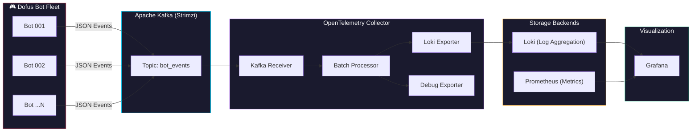
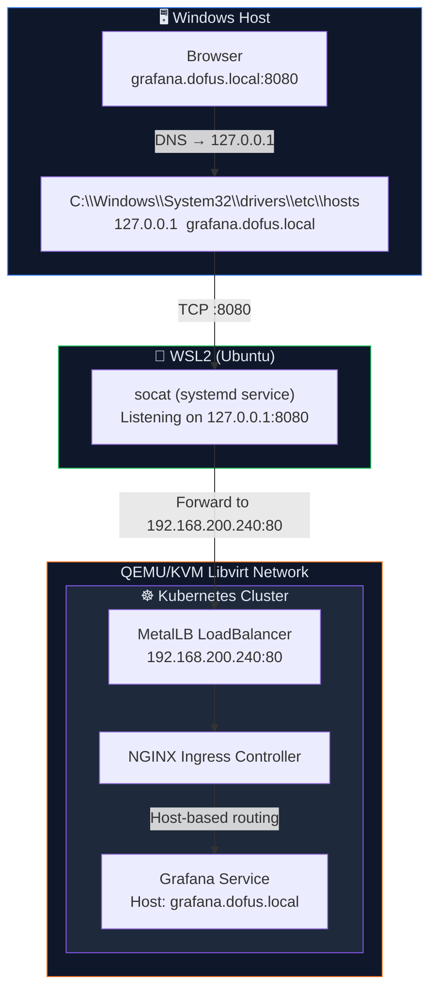

<p align="center">
  <h1 align="center">🎮 Dofus Bot Fleet — Observability Platform</h1>
  <p align="center">
    <strong>A fully automated, bare-metal GitOps Kubernetes cluster powering an event-driven observability pipeline for a fleet of automated Dofus game bots.</strong>
  </p>
</p>

<p align="center">
  
  
  
  
  
  
  
  
  
  
</p>

---

## 📖 Table of Contents

- [Project Overview](#-project-overview)
- [Architecture](#-architecture)
  - [High-Level Data Flow](#high-level-data-flow)
  - [Network Routing (WSL ↔ Windows Bridge)](#network-routing-wsl--windows-bridge)
- [Tech Stack](#-tech-stack)
- [Repository Structure](#-repository-structure)
- [Prerequisites](#-prerequisites)
- [Deployment](#-deployment)
  - [Layer 0 — Infrastructure Provisioning (Terraform)](#layer-0--infrastructure-provisioning-terraform)
  - [Layer 1 — Cluster Bootstrapping (Ansible)](#layer-1--cluster-bootstrapping-ansible)
  - [Layer 2 — GitOps Sync (ArgoCD)](#layer-2--gitops-sync-argocd)
- [Local Networking Setup](#-local-networking-setup)
  - [Windows hosts File](#1-windows-hosts-file)
  - [WSL socat Systemd Service](#2-wsl-socat-systemd-service)
- [Verification](#-verification)
- [Grafana Dashboard](#-grafana-dashboard)
- [Alerting](#-alerting)
- [License](#-license)

---

## 🔭 Project Overview

This repository implements a **production-grade, event-driven observability pipeline** designed to monitor a fleet of automated [Dofus](https://www.dofus.com/) game bots in real-time. The entire platform runs on a bare-metal Kubernetes cluster provisioned via a three-layer automation stack:

| Layer | Tool | Responsibility |
|:-----:|:-----|:---------------|
| **0** | Terraform | Provisions VMs on QEMU/KVM via Libvirt (the "Golden Image" pattern) |
| **1** | Ansible | Bootstraps `kubeadm` Kubernetes + core cluster services |
| **2** | ArgoCD | Continuously deploys the Helm Umbrella Chart from this Git repository |

The bots emit structured JSON telemetry events into **Apache Kafka**. An **OpenTelemetry Collector** consumes these events, batches them, and routes logs to **Loki** for aggregation. **Grafana** provides a unified visualization layer with pre-provisioned dashboards and Prometheus-powered alerting — all managed as code.

> **Design Philosophy:** _Dashboards as Code._ All Grafana dashboards, datasource configurations, and alerting rules are declared as standalone files in the `configs/` directory and injected at deploy time via Helm's `.Files.Get` pattern. Zero manual configuration is required.

---

## 🏗️ Architecture

### High-Level Data Flow



### Network Routing (WSL ↔ Windows Bridge)

Because the Kubernetes cluster runs inside a nested Libvirt network within WSL2, a custom bridge routes browser traffic from the Windows host all the way to Grafana:



---

## 🧱 Tech Stack

| Category | Technology | Version / Details |
|:---------|:-----------|:-----------------|
| **Hypervisor** | QEMU/KVM via Libvirt | Running on Ubuntu inside WSL2 on Windows |
| **Infrastructure as Code** | Terraform + Libvirt Provider | Ubuntu 24.04 Cloud Images, cloud-init, x86-64-v2 CPU passthrough |
| **Configuration Management** | Ansible | `kubeadm` bootstrap, Flannel CNI, MetalLB, ArgoCD installation |
| **Container Orchestration** | Kubernetes (`kubeadm`) | 1 Control Plane + N Worker Nodes |
| **GitOps** | ArgoCD | Continuous delivery of the Helm Umbrella Chart |
| **Networking** | MetalLB (L2/ARP) | IP range: `192.168.200.240–250` |
| **Ingress** | NGINX Ingress Controller | `v4.15.1` — Host-based routing |
| **Streaming** | Apache Kafka (Strimzi Operator `v0.51.0`) | KRaft mode, 2 replicas, JMX Prometheus metrics |
| **Telemetry Pipeline** | OpenTelemetry Collector Contrib | `v0.100.0` — Kafka receiver → Loki exporter |
| **Log Aggregation** | Grafana Loki (`loki-stack v2.10.2`) | Persistent storage, 2Gi |
| **Metrics** | Prometheus (`kube-prometheus-stack v65.1.0`) | Full stack with Alertmanager |
| **Visualization** | Grafana | Pre-provisioned dashboards + datasources |

---

## 📂 Repository Structure

```
botObservability/
├── README.md                                    # ← You are here
├── dofus-observability/                         # Helm Umbrella Chart
│   ├── Chart.yaml                               # Chart metadata & dependencies
│   ├── Chart.lock                               # Pinned dependency versions
│   ├── values.yaml                              # All configurable values
│   ├── charts/                                  # Downloaded dependency charts
│   ├── configs/                                 # Standalone config files (Dashboards as Code)
│   │   ├── dofus-dashboard.json                 # Grafana dashboard: Kamas Balance + Bot Events
│   │   ├── grafana-datasources.yaml             # Auto-provisioned datasources: Prometheus + Loki
│   │   ├── otel-collector-config.yaml           # OTel pipeline configuration
│   │   └── prometheus-alerts.yaml               # Alert rule: KamasSuddenDrop (>500k in 5m)
│   └── templates/                               # Kubernetes manifests (no inline configs)
│       ├── kafka-cluster.yaml                   # Strimzi Kafka Cluster + KafkaNodePool + KafkaTopic + KafkaBridge
│       └── metallb-config.yaml                  # MetalLB IPAddressPool + L2Advertisement
└── .gitignore
```

---

## ✅ Prerequisites

Ensure the following tools and environments are available on your system before starting deployment:

### Host Machine (Windows)

| Requirement | Purpose |
|:------------|:--------|
| **Windows 10/11** | Host operating system |
| **WSL2** | Hosts the Ubuntu environment running the hypervisor |
| **Administrator access** | Required to edit the `hosts` file |

### WSL2 (Ubuntu)

| Requirement | Installation | Purpose |
|:------------|:-------------|:--------|
| **QEMU/KVM + Libvirt** | `sudo apt install qemu-kvm libvirt-daemon-system` | VM hypervisor |
| **Terraform** ≥ 1.5 | [HashiCorp Install Guide](https://developer.hashicorp.com/terraform/install) | Infrastructure provisioning |
| **Ansible** ≥ 2.15 | `sudo apt install ansible` | Cluster bootstrapping |
| **kubectl** | [Kubernetes Install Guide](https://kubernetes.io/docs/tasks/tools/) | Cluster management |
| **Helm** ≥ 3.12 | [Helm Install Guide](https://helm.sh/docs/intro/install/) | Chart deployment |
| **socat** | `sudo apt install socat` | Network bridge (WSL ↔ Libvirt) |

---

## 🚀 Deployment

The deployment follows a layered approach — each layer builds on the previous one.

### Layer 0 — Infrastructure Provisioning (Terraform)

Terraform provisions the cluster VMs using the **Single Golden Image** pattern: one Ubuntu 24.04 cloud image is downloaded once and used as the base for all nodes.

```bash
# Initialize the Terraform workspace
terraform init

# Review the execution plan
terraform plan

# Provision the VMs (1 Control Plane + N Workers)
terraform apply -auto-approve
```

**What Terraform does:**
- Downloads the Ubuntu 24.04 cloud image (once)
- Creates cloned volumes from the golden image for each node
- Configures `cloud-init` for SSH key injection, password setup, and hostname assignment
- Applies `x86-64-v2` CPU passthrough for KVM compatibility
- Attaches all VMs to the Libvirt NAT network

> **💡 Tip:** After provisioning, verify SSH access to all nodes:
> ```bash
> ssh ubuntu@<control-plane-ip>
> ssh ubuntu@<worker-node-ip>
> ```

---

### Layer 1 — Cluster Bootstrapping (Ansible)

The Ansible playbook transforms the provisioned VMs into a functional Kubernetes cluster.

```bash
# Run the full bootstrap playbook
ansible-playbook -i inventory.ini site.yml
```

**What Ansible does:**
1. Installs container runtime (`containerd`) and Kubernetes packages (`kubeadm`, `kubelet`, `kubectl`)
2. Initializes the control plane with `kubeadm init`
3. Joins worker nodes to the cluster with `kubeadm join`
4. Deploys **Flannel** as the CNI plugin
5. Installs **MetalLB** for bare-metal LoadBalancer support (L2 mode, ARP-based)
6. Installs **ArgoCD** for GitOps-based continuous delivery

> **💡 Tip:** Verify the cluster is healthy:
> ```bash
> kubectl get nodes -o wide
> kubectl get pods -n metallb-system
> kubectl get pods -n argocd
> ```

---

### Layer 2 — GitOps Sync (ArgoCD)

ArgoCD watches this repository and automatically deploys the `dofus-observability` Helm Umbrella Chart to the cluster.

```bash
# Port-forward to the ArgoCD UI (if not already exposed)
kubectl port-forward svc/argocd-server -n argocd 8443:443

# Retrieve the initial admin password
kubectl -n argocd get secret argocd-initial-admin-secret -o jsonpath="{.data.password}" | base64 -d

# Create the ArgoCD Application (or apply via the UI)
kubectl apply -f - <<EOF
apiVersion: argoproj.io/v1alpha1
kind: Application
metadata:
  name: dofus-observability
  namespace: argocd
spec:
  project: default
  source:
    repoURL: https://github.com/<your-org>/botObservability.git
    targetRevision: main
    path: dofus-observability
    helm:
      valueFiles:
        - values.yaml
  destination:
    server: https://kubernetes.default.svc
    namespace: default
  syncPolicy:
    automated:
      prune: true
      selfHeal: true
    syncOptions:
      - CreateNamespace=true
EOF
```

**What ArgoCD deploys (via the Helm Umbrella Chart):**

| Component | Sub-Chart / Template | Purpose |
|:----------|:---------------------|:--------|
| **kube-prometheus-stack** | Sub-chart `v65.1.0` | Prometheus, Grafana, Alertmanager |
| **Loki Stack** | Sub-chart `v2.10.2` | Log aggregation (Promtail disabled) |
| **NGINX Ingress** | Sub-chart `v4.15.1` | Ingress controller with LoadBalancer service |
| **Strimzi Kafka Operator** | Sub-chart `v0.51.0` | Kafka operator CRDs + controller |
| **Kafka Cluster** | Template `kafka-cluster.yaml` | 2-replica KRaft cluster + `bot_events` topic + HTTP Bridge |
| **OpenTelemetry Collector** | Sub-chart `v0.150.1` | Kafka → Loki pipeline |
| **MetalLB Config** | Template `metallb-config.yaml` | L2 IP pool `192.168.200.240–250` |

---

## 🌐 Local Networking Setup

Since the Kubernetes cluster runs inside a Libvirt network within WSL2, traffic from the Windows browser must be bridged through multiple layers to reach Grafana.

### 1. Windows `hosts` File

Edit the Windows `hosts` file to resolve `*.dofus.local` domains to localhost:

```powershell
# Run as Administrator
notepad C:\Windows\System32\drivers\etc\hosts
```

Append the following entries:

```
# Dofus Observability — Local Cluster
127.0.0.1    grafana.dofus.local
127.0.0.1    prometheus.dofus.local
127.0.0.1    alertmanager.dofus.local
```

### 2. WSL `socat` Systemd Service

Create a persistent `systemd` service inside WSL that forwards traffic from `127.0.0.1:8080` to the MetalLB LoadBalancer IP:

```bash
sudo tee /etc/systemd/system/kube-bridge.service > /dev/null <<'EOF'
[Unit]
Description=Socat bridge — WSL localhost to Kubernetes MetalLB
After=network-online.target
Wants=network-online.target

[Service]
Type=simple
# Bind strictly to IPv4 to avoid IPv6 conflicts on WSL
ExecStart=/usr/bin/socat TCP4-LISTEN:8080,bind=127.0.0.1,reuseaddr,fork TCP4:192.168.200.240:80
Restart=always
RestartSec=5

[Install]
WantedBy=multi-user.target
EOF
```

Enable and start the service:

```bash
sudo systemctl daemon-reload
sudo systemctl enable --now kube-bridge.service

# Verify it is running
sudo systemctl status kube-bridge.service
```

### 3. Access the Services

Once the bridge is active, open your Windows browser:

| Service | URL |
|:--------|:----|
| **Grafana** | [`http://grafana.dofus.local:8080`](http://grafana.dofus.local:8080) |
| **Prometheus** | [`http://prometheus.dofus.local:8080`](http://prometheus.dofus.local:8080) |
| **Alertmanager** | [`http://alertmanager.dofus.local:8080`](http://alertmanager.dofus.local:8080) |

> **Default Grafana credentials:** `admin` / `admin` (configurable via `kube-prometheus-stack.grafana.adminPassword` in `values.yaml`)

---

## ✔️ Verification

### 1. Validate Cluster Components

```bash
# All pods should be Running
kubectl get pods -A

# Verify Kafka cluster is ready
kubectl get kafka dofus-kafka -o jsonpath='{.status.conditions[?(@.type=="Ready")].status}'

# Verify the bot_events topic exists
kubectl get kafkatopic bot-events -o wide

# Verify OTel Collector is running
kubectl get pods -l app.kubernetes.io/name=opentelemetry-collector

# Verify MetalLB assigned an external IP to NGINX
kubectl get svc -l app.kubernetes.io/name=ingress-nginx
```

### 2. End-to-End Pipeline Test

Spin up a temporary Kafka producer pod to inject a synthetic bot event:

```bash
kubectl run kafka-producer --rm -it \
  --image=quay.io/strimzi/kafka:latest-kafka-3.9.0 \
  --restart=Never -- \
  bin/kafka-console-producer.sh \
    --broker-list dofus-kafka-kafka-bootstrap:9092 \
    --topic bot_events
```

When the producer prompt appears, paste the following JSON payload and press `Enter`:

```json
{"botName":"bot-test-001","server":"Boune","kamasBruts":15000,"kamasBank":450000,"kamasHdv":30000}
```

Press `Ctrl+C` to exit the producer pod.

### 3. Alternatively, Use the Kafka HTTP Bridge

If the Kafka Bridge is deployed, send a test event via HTTP:

```bash
# From within WSL, using the NodePort service
curl -X POST \
  http://<worker-node-ip>:32080/topics/bot_events \
  -H 'Content-Type: application/vnd.kafka.json.v2+json' \
  -d '{
  "records": [
    {
      "key": "bot-test-001",
      "value": {
        "botName": "bot-test-001",
        "server": "Boune",
        "kamasBruts": 15000,
        "kamasBank": 450000,
        "kamasHdv": 30000
      }
    }
  ]
}'
```

### 4. Verify in Grafana

1. Navigate to [`http://grafana.dofus.local:8080`](http://grafana.dofus.local:8080)
2. Log in with `admin` / `admin`
3. Open the **Dofus Bot Fleet** dashboard (UID: `dofus-bots`)
4. The **Bot Events Log Stream** panel should display the injected event
5. If Prometheus metrics are flowing, the **Kamas Balance Over Time** panel will render bot data

---

## 📊 Grafana Dashboard

The **Dofus Bot Fleet** dashboard (`uid: dofus-bots`) is provisioned automatically as code and includes:

| Panel | Type | Datasource | Description |
|:------|:-----|:-----------|:------------|
| **Kamas Balance Over Time** | Time Series | Prometheus | Tracks `dofus_bot_kamas` gauge per bot/server with threshold markers (500k = red) |
| **Bot Events Log Stream** | Logs | Loki | Live log stream from `{topic="bot_events"}` with pretty-printed JSON |

**Template Variables:** `bot_name` and `server` (multi-select with "All" option) for fleet-wide filtering.

---

## 🚨 Alerting

Prometheus alerting rules are defined in [`configs/prometheus-alerts.yaml`](dofus-observability/configs/prometheus-alerts.yaml) and loaded via the **PrometheusRule CRD**.

| Alert | Expression | Duration | Severity |
|:------|:-----------|:---------|:---------|
| **KamasSuddenDrop** | `(max_over_time(dofus_bot_kamas[5m]) - dofus_bot_kamas) > 500000` | 1 minute | 🔴 `critical` |

**Trigger condition:** Fires when any bot's kamas balance drops by more than **500,000** within a rolling **5-minute** window — indicating a potential ban, theft, or in-game exploit.

---

## 📄 License

Internal use only — DevOps Team.